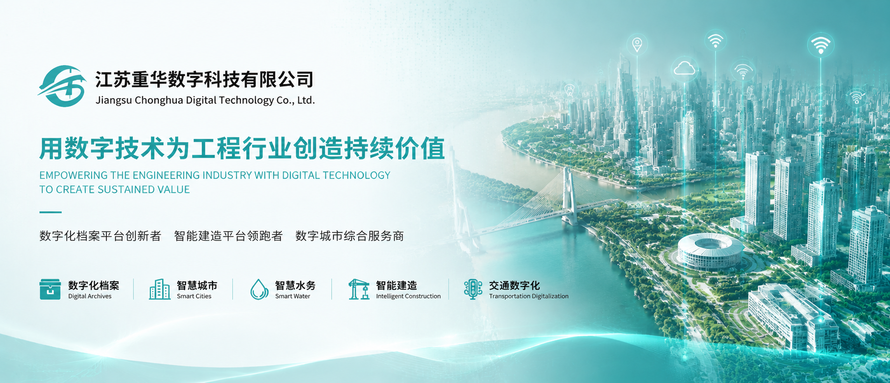

# 重华数科

### 用数字技术为工程行业创造持续价值

**数字化档案平台创新者 · 智能建造平台领跑者 · 数字城市综合服务商**

[官网](https://www.smartcitychsk.com/) · [公司产品](https://www.smartcitychsk.com/cp/) · [业务领域](https://www.smartcitychsk.com/ywly/znjz/) · [应用案例](https://www.smartcitychsk.com/yyal/) · [科技成果](https://www.smartcitychsk.com/kjcg/zljs/)

**简体中文** | [English](README_EN.md)

---

## 关于我们

江苏重华数字科技有限公司（简称 **重华数科**），是重庆大学溧阳智慧城市研究院旗下的智慧城市建设综合服务商。

公司秉持“**用数字技术为工程行业创造持续价值**”的理念，依托 **Citycore 数字引擎**核心技术，面向政府、园区、交通、水务、建造与城市治理等场景，提供智能建造、数字档案、数字城市等解决方案及 BIM 全过程咨询服务，持续推动智慧城市建设、工程行业数字化转型与产学研用深度融合。

---

## 品牌价值

| 价值定位 | 能力说明 |
| --- | --- |
| **数字化档案平台创新者** | 以工程资料、电子文件和城市基础设施数据为核心，构建覆盖形成、采集、整理、电子签名/电子签章、归档、检索、利用、治理与长期保存的数字档案平台，让档案成为可沉淀、可追溯、可验证、可分析、可复用的数字资产。 |
| **智能建造平台领跑者** | 融合 BIM、IoT、AI、数据驾驶舱与项目协同管理能力，贯通工程建设全过程，实现人、机、料、法、环全景数字化，提升项目质量、安全、进度与成本管控水平。 |
| **数字城市综合服务商** | 依托 CIM、GIS、数字孪生和数据治理能力，面向智慧园区、智慧交通、智慧水务、城市运行和基础设施管理等场景，打造城市级数字底座与综合运营服务体系。 |

---

## 核心产品

<table>
  <tr>
    <th width="24%">产品</th>
    <th width="58%">简介</th>
    <th width="18%">链接</th>
  </tr>
  <tr>
    <td><strong>城智核心 Citycore</strong></td>
    <td>国内算法驱动组件化引擎，通过参数化图形引擎、结构化表单引擎及扩展组件，构建“算法驱动数据、数据驱动引擎、引擎支撑应用”的模式。</td>
    <td><a href="https://www.smartcitychsk.com/cp/index.html">了解更多</a></td>
  </tr>
  <tr>
    <td><strong>数字化档案平台</strong></td>
    <td>面向工程建设、交通基础设施、城市治理与政企档案管理场景，构建电子文件形成、采集、整理、电子签名/电子签章、归档、移交、保管、检索、利用与长期保存的一体化数字档案体系。平台融合 AI 智能识别、可信签署、验签防篡改、知识检索、数据治理、权限管控与安全存储能力，让档案从“静态资料库”升级为可沉淀、可追溯、可验证、可分析、可复用的城市级数字资产底座。</td>
    <td><a href="https://www.smartcitychsk.com/">了解更多</a></td>
  </tr>
  <tr>
    <td><strong>重华交通数字化平台</strong></td>
    <td>面向公路建设项目，支撑工程电子档案形成、流转、办理、归档和管理，推动项目全过程无纸化。</td>
    <td><a href="https://www.smartcitychsk.com/cp/36.html">了解更多</a></td>
  </tr>
  <tr>
    <td><strong>重华智能建造平台</strong></td>
    <td>基于 Citycore 参数化图形引擎和管理结构化引擎，实现人、机、料、法、环全景数字化，为工程行业创造持续价值。</td>
    <td><a href="https://www.smartcitychsk.com/cp/35.html">了解更多</a></td>
  </tr>
</table>

---

## 业务领域

### 🏗 智能建造

围绕工程建设全过程，提供数字化应用、设计管理、进度管理、质量管理、材料管理、设备管理、安全管理等能力，帮助项目实现协同管理与精细化运营。

### 🚰 智慧水务

面向供排水、水环境与流域治理等场景，构建全流域智慧感知、综合应用、移动端应用、联合调度、统计分析、永久性数字档案、三维可视化“一张图”等能力。

### 🏙 数字城市

服务智慧园区、智慧交通、智慧停车、智慧应急、智能安防、智慧服务、智慧教育、智慧医疗等城市数字化场景，打造城市级数据底座与可视化治理平台。

### 📁 数字档案

面向工程项目、交通建设与城市基础设施，支持电子文件形成、电子签名/电子签章、签署留痕、验签防篡改、归档、检索、利用和安全管理，推动档案管理数字化、可信化、标准化和全过程闭环。

---

## 技术能力

| 数字底座 | 工程数字化 | 城市治理 | 智能应用 |
| --- | --- | --- | --- |
| Citycore 数字引擎 | BIM 全过程咨询 | CIM / 数字孪生 | AI 数据驾驶舱 |
| 参数化图形引擎 | 智慧工地 | 城市运行管理 | 行业知识库 |
| 结构化表单引擎 | 交通数字化 | 三维可视化一张图 | 数据分析与决策支持 |
| 数据治理 | 项目协同管理 | 智慧园区 | 系统集成 |

---

## 应用案例

重华数科已为江苏、河北、福建、重庆、浙江等多地客户提供服务，覆盖数百个项目，并多次获得国家、省部级奖项。

官网展示案例包括：

- [苏控智慧城建造与协同管理平台](https://www.smartcitychsk.com/html/157.html)
- [厦门会展中心 BIM 项目管理平台](https://www.smartcitychsk.com/html/27.html)
- [通苏嘉甬智慧工地协同管理平台](https://www.smartcitychsk.com/html/158.html)
- [河北通涛城市管网综合管理 CIM 平台](https://www.smartcitychsk.com/html/154.html)
- [溧阳市中关村智慧园区 CIM+ 数字基座](https://www.smartcitychsk.com/html/25.html)
- [高新区城市运行管理平台](https://www.smartcitychsk.com/html/165.html)
- [安顺控股智慧燃气系统](https://www.smartcitychsk.com/html/164.html)

---

## 科研与创新

重庆大学溧阳智慧城市研究院致力于人才培养、科技创新、产业集聚三大功能，围绕智慧建造、智能设计与检测、智慧地下空间、智慧环保、智慧能源、智慧交通、现代物理、智慧城乡规划设计等方向建设研究中心。

重华数科持续关注并投入：

- Citycore 数字引擎与行业组件研发
- 智能建造与智慧工地平台能力建设
- 数字档案与工程资料全过程管理
- CIM、BIM、GIS、IoT、数字孪生融合应用
- AI + 工程知识库、AI 数据驾驶舱与智能决策
- 智慧水务、智慧交通、智慧园区等行业解决方案

---

## 业务能力与技术模块

围绕数字化档案、智能建造与数字城市三大方向，重华数科沉淀了从数据采集、业务建模、平台开发到可视化应用的一体化技术能力。

- **数字化档案模块**：电子文件采集、电子签名/电子签章、签署留痕、验签防篡改、档案整理归档、元数据管理、全文检索、权限控制、长期保存、档案利用与数据治理。
- **智能建造模块**：项目协同管理、进度管理、质量安全管理、物料设备管理、BIM 应用、智慧工地、AI 数据驾驶舱。
- **数字城市模块**：CIM 基础平台、GIS 空间服务、数字孪生场景、城市运行监测、智慧园区、智慧交通、智慧水务。
- **数据底座能力**：多源数据接入、数据清洗治理、主数据管理、指标体系、可视化大屏、数据分析与辅助决策。
- **平台技术能力**：微服务架构、云原生部署、统一身份认证、权限体系、低代码配置、系统集成与接口开放。

---

## 相关链接

- 🌐 官网：[https://www.smartcitychsk.com](https://www.smartcitychsk.com/)
- 🏢 关于我们：[公司简介](https://www.smartcitychsk.com/gywm/gsjj/)
- 🧩 公司产品：[产品中心](https://www.smartcitychsk.com/cp/)
- 🧭 业务领域：[智能建造](https://www.smartcitychsk.com/ywly/znjz/) / [智慧水务](https://www.smartcitychsk.com/ywly/zhsw/) / [数字城市](https://www.smartcitychsk.com/ywly/szcs/)
- 🏆 科技成果：[专利技术](https://www.smartcitychsk.com/kjcg/zljs/)
- 🤝 合作伙伴：[合作伙伴](https://www.smartcitychsk.com/gywm/hzhb/)
- 📮 联系我们：[联系方式](https://www.smartcitychsk.com/lxwm/)

---

**重华数科 — 用数字技术为工程行业创造持续价值**

Copyright © 江苏重华数字科技有限公司. All rights reserved.

